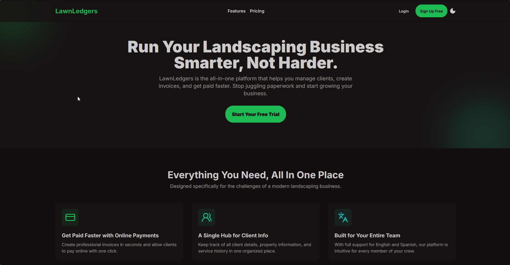

# 🌿 LawnLedgers

> An all-in-one SaaS platform for small to medium-sized landscaping businesses — manage clients, schedule jobs, send invoices, and get paid faster.

Built as a solo full-stack project to solve a real problem: most landscaping companies are run by skilled tradespeople who shouldn't have to juggle spreadsheets, paper invoices, and disconnected tools just to run their business.



---

## 🌐 Live Demo

[Marketing Site](https://kolkenn.github.io/lawn-ledgers/) — static landing page deployed via GitHub Pages

---

## 📐 Architecture

This is a monorepo containing three independently deployable components:

```
lawn-ledgers/
├── backend/          # Python / FastAPI REST API
├── webapp/           # React / JSX frontend (the app)
└── marketing-site/   # Static HTML marketing landing page
```

---

## 🛠️ Tech Stack

### Backend
| Technology | Purpose |
|---|---|
| Python 3.13+ + FastAPI | REST API and webhook handling |
| Firebase Admin SDK + Firestore | Database and server-side auth |
| Stripe Subscriptions API | Billing and plan management |
| Stripe Connect API | Contractor payment processing |
| uv | Dependency and environment management |

### Frontend (webapp)
| Technology | Purpose |
|---|---|
| React 18 + JSX | UI framework |
| Vite | Build tooling |
| React Router v6 | Client-side routing and route protection |
| TanStack Query | Async data fetching, caching, and state management |
| DaisyUI + Tailwind CSS | Component library and styling |
| react-i18next | Internationalization (EN / ES / FR) |
| Firebase Auth | Authentication (email/password + Google SSO) |

### Marketing Site
| Technology | Purpose |
|---|---|
| HTML + Tailwind CSS (CDN) | Static landing page |
| DaisyUI | Component styling and theming |
| Lucide Icons | Iconography |

---

## ✅ Features Implemented

### Authentication & Onboarding
- Email/password and Google SSO authentication via Firebase
- Multi-step company creation flow (name → address → subscription → payment setup)
- Route guards that enforce onboarding completion before app access
- Subscription gating — owners are prompted to subscribe, crew members see a contact-admin notice
- Auto-logout on idle via a custom `useIdleTimer` hook
- Animated password strength indicator with real-time validation feedback

### Session & Data Architecture
- TanStack Query manages all async data fetching with intelligent caching (5 min stale time for company and role data)
- Auth context handles multi-company membership — users belonging to multiple companies can switch between them
- Staged loading UX in protected routes: "Authenticating..." → "Confirming Membership..." → "Loading Active Company..." provides clear feedback at each step
- Onboarding status machine with four states: `checking`, `needsSubscription`, `subscriptionRequired_contactAdmin`, `complete`

### Billing (Stripe Subscriptions)
- Stripe Checkout integration for new subscriptions with optional 14-day trial
- Stripe Customer Portal for self-serve plan management and cancellations
- Secure webhook endpoint for real-time subscription lifecycle events (`customer.subscription.*`)
- Firestore automatically updated on every subscription state change

### Payments (Stripe Connect)
- Stripe Connect onboarding flow for contractors to accept client payments
- Account creation with optional pre-filling from company profile data
- Webhook handling for `account.updated` to track onboarding completion status
- Charges and payouts status reflected in real time via Firestore

### App
- Protected dashboard and settings pages
- Company profile management (name, address, logo upload)
- Team management with role-based access (Owner / Crew)
- Full light/dark theme support (emerald / forest)
- Complete translations via i18n: **English**, **Spanish**, and **French**

### Marketing Site
- Responsive landing page with features, pricing, and add-on sections
- Auto-hiding header on mobile scroll
- Light/dark theme toggle with localStorage persistence
- Deployed automatically via GitHub Actions to GitHub Pages

---

## 🚧 Planned / In Progress

The i18n architecture already includes navigation keys for these upcoming features, meaning the translation groundwork is laid:

- [ ] Client CRM — contact management, property details, service history
- [ ] Job scheduling — calendar view, job assignment to crew members
- [ ] Invoice generation — PDF invoices with online payment links
- [ ] Time clock — crew check-in/check-out tracking
- [ ] Route optimization — efficient scheduling for multi-stop service days
- [ ] Mobile app (React Native) — field-facing crew interface

---

## 🚀 Running Locally

### Prerequisites
- Python 3.13+
- Node.js 18+
- [uv](https://docs.astral.sh/uv/) (Python package manager)
- A Firebase project with Firestore and Authentication enabled
- A Stripe account with test keys

### Backend

```bash
cd backend

# Create and activate virtual environment
uv venv
source .venv/bin/activate  # Windows: .venv\Scripts\activate

# Install dependencies
uv sync

# Set up environment variables
cp .env.example .env
# Fill in your Stripe and Firebase credentials in .env

# Add your Firebase service account key
# Download from Firebase Console → Project Settings → Service Accounts
# Save as: backend/serviceAccountKey.json

# Start the development server
uvicorn main:app --reload
```

### Frontend (webapp)

```bash
cd webapp

# Install dependencies
npm install

# Set up environment variables
cp .env.example .env
# Fill in your Firebase config and backend URL

# Start the development server
npm run dev
```

### Marketing Site

```bash
cd marketing-site
# Open index.html directly in a browser — no build step required
```

---

## 🔐 Environment Variables

### Backend `.env`
```
STRIPE_SECRET_KEY=sk_test_your_key_here
STRIPE_WEBHOOK_SECRET=whsec_your_secret_here
CLIENT_BASE_URL=http://localhost:5173
CORS_ORIGINS=http://localhost:5173
```

### Frontend `.env`
```
VITE_FIREBASE_API_KEY=your_api_key_here
VITE_FIREBASE_AUTH_DOMAIN=your_project.firebaseapp.com
VITE_FIREBASE_PROJECT_ID=your_project_id
VITE_FIREBASE_STORAGE_BUCKET=your_project.appspot.com
VITE_FIREBASE_MESSAGING_SENDER_ID=your_sender_id
VITE_FIREBASE_APP_ID=your_app_id
VITE_BACKEND_URL=http://localhost:8000
```

> **Note:** A `serviceAccountKey.json` Firebase service account file is required for the backend. Download it from your Firebase project console. This file is gitignored and should never be committed.

---

## 🚢 Deployment

### Marketing Site (GitHub Pages)

The marketing site deploys automatically to GitHub Pages on every push to `main` that includes changes in `marketing-site/`. No manual steps required.

Live at: [https://kolkenn.github.io/lawn-ledgers/](https://kolkenn.github.io/lawn-ledgers/)

### Backend & Webapp

Both are designed for cloud deployment. Environment-specific configuration is handled entirely through `.env` files — no code changes required between environments.

---

## 📌 Status

Active side project — core billing, authentication, payment infrastructure, and internationalization are complete. CRM, scheduling, and invoicing features are in active development.

---

## 🧑‍💻 Author

**Leonel Ponce** — [LinkedIn](https://www.linkedin.com/in/leonelponce-862391214) · [GitHub](https://github.com/Kolkenn)

> Built from scratch because real problems deserve real solutions.

---

© 2025 Leonel Ponce. All rights reserved. This repository is publicly visible for portfolio purposes only.
